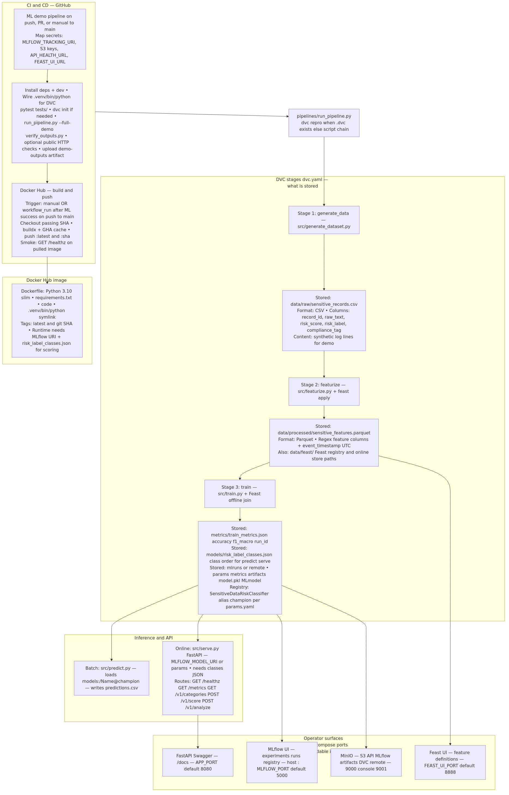

# Sensitive data risk — MLOps pipeline (demo)



**How this pipeline works (four steps):**

1. **Generate & version** — Synthetic `raw_text` and labels are written to CSV; **DVC** (`dvc.yaml`) chains **`generate_data` → `featurize` → `train`** so outputs stay reproducible.  
2. **Feature store** — **`pii_detector.py`** turns text into numeric PII-style signals; **Feast** applies definitions and writes **`sensitive_features.parquet`** for training.  
3. **Train & register** — **`LogisticRegression`** learns **LOW / MEDIUM / HIGH** risk from those features; **MLflow** logs the run and registers **`SensitiveDataRiskClassifier`** with alias **`champion`**.  
4. **Consume** — **`predict.py`** scores CSV rows; **FastAPI** (`serve.py`) exposes **`/v1/score`**, **`/v1/analyze`**, and health/metrics — the same **`pipelines/run_pipeline.py --full-demo`** entrypoint runs in **GitHub Actions** (push/PR to **`main`** or manual) and **GitLab CI** for enterprise builds.

**Links:** [Plain-text README](README.txt) · [Mermaid source](docs/pipeline_overview.mmd) · [Push to GitHub](docs/GITHUB_SETUP.md) · [Docker + self-hosted MLflow/MinIO](docs/DOCKER.md)

This repository is a **demo** (not certified compliance software).

### Fully automatic demo (one command)

From the **project root**, on **Linux/macOS** (creates **`.venv`**, installs deps, runs **`dvc init`** only if **`.dvc/`** is missing, then **full pipeline + `predictions.csv`**):

```bash
bash scripts/run_full_demo.sh
```

On **Windows**, use **Git Bash** / **WSL** for the script, or run the equivalent steps manually (**venv** → **pip** → **`dvc init`** if needed → **`python pipelines/run_pipeline.py --full-demo`**).

Or with **Make**: `make demo` (same script).

If the environment already exists, you only need:

```bash
.venv/bin/python pipelines/run_pipeline.py --full-demo
```

That runs **`dvc repro`** (or the three scripts without DVC) and then **`src/predict.py`** on **`sample_input.csv`**. **GitLab CI:** **`.gitlab-ci.yml`** runs **`pipelines/run_pipeline.py --full-demo`** on push/MR (45m timeout, **`PATH`** includes **`.venv/bin`** for **DVC**). **GitHub Actions:** **`.github/workflows/ml-demo.yml`** — runs on **push** / **pull_request** to **`main`** or **Actions → “ML demo pipeline” → Run workflow** (45m timeout, **`ubuntu-22.04`**, least-privilege **`permissions`**). Optional **secrets** point MLflow/S3 at your **public hosted** URLs and smoke-test **API** / **Feast UI** — see **`docs/GITHUB_SETUP.md`**.

---

## How this use case works (one path through the code)

| Order | What runs | Input → output |
|------|------------|----------------|
| 1 | **`src/generate_dataset.py`** | Writes **`data/raw/sensitive_records.csv`** — synthetic `raw_text` + risk labels. |
| 2 | **`src/featurize.py`** | Reads raw CSV, computes PII hit counts + `text_length` via **`pii_detector`**, writes **`data/processed/sensitive_features.parquet`**, runs **`feast apply`**. |
| 3 | **`src/train.py`** | Loads Feast offline features + labels, trains **`LogisticRegression`**, logs metrics to MLflow, registers **`SensitiveDataRiskClassifier`**, sets **`@champion`**, writes **`metrics/train_metrics.json`** and **`models/risk_label_classes.json`**. |
| 4 | **`src/predict.py`** | Loads **`models:/SensitiveDataRiskClassifier@champion`**, scores CSV rows (`raw_text` column). |
| 5 | **`src/serve.py`** | Same model + features: **`POST /v1/score`**, **`POST /v1/analyze`** (queue payload), **`GET /v1/categories`**, **`/healthz`**, **`/metrics`**. |

**DVC:** `dvc.yaml` defines stages `generate_data` → `featurize` → `train`. **`pipelines/run_pipeline.py`** runs **`dvc repro`** when **`.dvc/`** exists.

**Model:** Multiclass **logistic regression** on 7 numeric features (see **`params.yaml`** `train.model: logistic_regression`). Entity lists and demo confidences on **`/v1/analyze`** are **regex/heuristics**, not a second NER model.

---

## How the pipeline is triggered

Nothing in this repo **automatically** retrains on a timer or on API traffic by default. Training runs only when **something explicitly starts** it.

| Trigger | What happens |
|---------|----------------|
| **You (local / VM)** | Run **`.venv/bin/python pipelines/run_pipeline.py`**. If **`.dvc/`** exists, that script runs **`dvc repro`**, which reads **`dvc.yaml`** / **`dvc.lock`** and executes stages whose inputs or dependencies changed (`generate_data` → `featurize` → `train`). If **`.dvc/`** is missing, the script runs the same three steps as plain **`python`** calls in order (no DVC cache). |
| **You (DVC only)** | Run **`.venv/bin/dvc repro`** yourself — same effect as above when DVC is initialized. |
| **GitLab CI** | On a **Git push / merge request / manual pipeline** (per your GitLab project rules), the job in **`.gitlab-ci.yml`** (`sensitive_data_mlops`) creates a venv, installs deps, then runs **`pipelines/run_pipeline.py --full-demo`** (pipeline + **`predictions.csv`**). Set **`MLFLOW_TRACKING_URI`** in CI variables if you want runs on a shared MLflow server. |
| **GitHub Actions** | **`.github/workflows/ml-demo.yml`** — **push** / **PR** to **`main`** or manual **Actions → “ML demo pipeline”** (`ubuntu-22.04`, 45m). Secrets for hosted **MLflow**, **MinIO/S3**, **`/healthz`**, **Feast UI**: **`docs/GITHUB_SETUP.md`**. |
| **One-shot script** | **`bash scripts/run_full_demo.sh`** or **`make demo`** — bootstraps venv + DVC (if needed) + pipeline + predict. |

**Not a training trigger:** calling **FastAPI** (`/v1/score`, `/v1/analyze`) only **loads** the already-trained model and scores text — it does **not** start `train.py` or `dvc repro`.

**Production-style extensions** (not wired here): cron, Airflow / Dagster, Kubeflow Pipelines, GitHub Actions, or a webhook that runs **`dvc repro`** or **`run_pipeline.py`** on demand.

---

## Git hosting & CI (GitHub vs GitLab)

You **do not** need both **GitHub** and **GitLab**. Pick **one** place to host the Git remote. The repo already ships **optional** configs for each (the unused platform simply ignores the other file).

| If you use… | What runs in CI | What you do |
|-------------|-----------------|--------------|
| **GitHub** | **`.github/workflows/ml-demo.yml`** + mirror **`docs/github_actions_ml_demo.yml`**. | Create repo → **`git push`**. Pushing workflow updates needs a credential with **`workflow`** scope (e.g. **`gh auth login`** with a classic PAT). See **`docs/GITHUB_SETUP.md`**. |
| **GitLab** | **`.gitlab-ci.yml`** — job **`sensitive_data_mlops`** on **push / merge request** (depends on your project’s CI rules) | Create a new GitLab project → add **`origin`** → **`git push`**. Optional: **Settings → CI/CD → Variables** — set **`MLFLOW_TRACKING_URI`** to a shared MLflow server (otherwise CI uses `file://…/mlruns` in the job workspace). |

**Pushing an existing clone (first time)**

```bash
cd /path/to/mlproject
git status   # commit any changes you want on the remote
git remote add origin <HTTPS-or-SSH-URL-of-new-repo>
git branch -M main   # or keep master; match your host default
git push -u origin main
```

**Do you need a new repository?** Only if you want this code **online** or **CI in the cloud**. Local-only demos need **no** GitHub/GitLab.

**Removing the CI you do not use (optional, for clarity)**  
- GitHub-only: delete **`.gitlab-ci.yml`**.  
- GitLab-only: delete **`.github/workflows/`** and **`docs/github_actions_ml_demo.yml`** if you want zero GitHub Actions files.

**Other tools (optional, not required for the demo)**  
- **MLflow tracking server**: set **`MLFLOW_TRACKING_URI`** in CI or your shell so runs and registry are shared (not only `./mlruns` on disk).  
- **DVC remote** (S3, GCS, etc.): for versioning large **`data/`** outside Git; add **`dvc remote add`** and **`dvc push`** per [DVC remotes](https://dvc.org/doc/command-reference/remote).  
- **Docker / Kubernetes**: **`docker-compose.yml`** runs Postgres, MinIO, MLflow, **Feast UI**, **`dvc repro`** (train profile), and FastAPI — see **[docs/DOCKER.md](docs/DOCKER.md)**.

---

## Enterprise CI notes

- **GitHub Actions** (`.github/workflows/ml-demo.yml`): **`ubuntu-22.04`**, **45-minute** job timeout, **`permissions: contents: read`**, **`pip`** cache keyed on **`requirements.txt`**, **`PYTHONUNBUFFERED`**, and strict **`bash -euxo pipefail`** on install. **Triggers:** **`workflow_dispatch`**, **`push`**, and **`pull_request`** to **`main`**. **Optional repository secrets** (hosted / public endpoints): **`MLFLOW_TRACKING_URI`**, **`MLFLOW_S3_ENDPOINT_URL`**, **`AWS_ACCESS_KEY_ID`**, **`AWS_SECRET_ACCESS_KEY`**, **`AWS_DEFAULT_REGION`**, **`API_HEALTH_URL`** (base URL; CI checks **`/healthz`**), **`FEAST_UI_URL`** (full URL; CI expects **200**). Unset secrets → local **`$GITHUB_WORKSPACE/mlruns`**. Table and fork behavior: **`docs/GITHUB_SETUP.md`**. For **self-hosted runners**, replace **`runs-on: ubuntu-22.04`** with your runner label(s).
- **GitLab CI** (`.gitlab-ci.yml`): **45-minute** job timeout; **`PATH`** prepends **`.venv/bin`** so **`dvc init`** works after **`pip install`**. Configure **`MLFLOW_TRACKING_URI`** under **Settings → CI/CD → Variables** for enterprise tracking.

### Docker (self-hosted MLflow + MinIO + Feast UI + DVC + API)

Run the same codebase as containers: **PostgreSQL** (MLflow metadata), **MinIO** (MLflow + **DVC** artifacts), **MLflow**, **Feast UI** (registry under volume `feast_registry`), **`dvc repro`** via the **`train`** profile, and **FastAPI**.

```bash
cp .env.docker.example .env   # edit secrets; set PUBLIC_HOST to this VM's IP (see file)
docker compose build && docker compose up -d
docker compose --profile train run --rm train && docker compose restart app
make public-test   # optional: curl MLflow / API / Feast / MinIO on PUBLIC_HOST
```

Full integration table, public-IP / firewall notes, and **`make public-test`**: **[docs/DOCKER.md](docs/DOCKER.md)**. GitHub Actions secret examples for this host: **[docs/GITHUB_SETUP.md](docs/GITHUB_SETUP.md)** (update IP if your VM changes).

---

## Test this project step by step (all you need)

Work from the **project root** (directory that contains **`requirements.txt`** and **`dvc.yaml`**).

### Step 1 — Prerequisites

- **Python 3.10+** (`python3 --version`).
- **Linux/macOS** commands below; on **Windows** use **`.venv\Scripts\pip`** and **`.venv\Scripts\python`** instead of **`.venv/bin/...`**.

If `python3 -m venv .venv` fails, install **`python3-venv`** (Debian/Ubuntu: `sudo apt-get install -y python3-venv`).

### Step 2 — Virtual environment and dependencies

```bash
cd /path/to/mlproject
python3 -m venv .venv
.venv/bin/pip install --upgrade pip
.venv/bin/pip install -r requirements.txt
```

### Step 3 — Git + DVC (first time only)

**If `.dvc/` already exists**, skip **`dvc init`** and go to **Step 4**.

With Git:

```bash
git init
git add .
git commit -m "Initial project"
.venv/bin/dvc init
```

Without Git:

```bash
.venv/bin/dvc init --no-scm
```

If **`dvc init`** says **`.dvc` exists**, DVC is already initialized — continue to **Step 4**.

### Step 4 — Run the full pipeline

```bash
.venv/bin/python pipelines/run_pipeline.py
```

Expect exit code **0** and DVC stages: **generate_data** → **featurize** → **train** (Feast/MLflow warnings are often harmless).

### Step 5 — Confirm outputs on disk

```bash
test -f data/raw/sensitive_records.csv && wc -l data/raw/sensitive_records.csv
test -f data/processed/sensitive_features.parquet && echo "features OK"
test -f metrics/train_metrics.json && cat metrics/train_metrics.json
test -f models/risk_label_classes.json && echo "classes OK"
```

You should see a large CSV line count, **`train_metrics.json`** with **`accuracy`**, **`f1_macro`**, **`run_id`**, and the classes file present (needed for predict/serve).

### Step 6 — Batch inference test

```bash
.venv/bin/python src/predict.py --input sample_input.csv --output predictions.csv
head predictions.csv
```

**Pass:** CSV header includes **`raw_text`**, **`predicted_risk_label`**, **`risk_score`**, **`compliance_tag`**.

### Step 7 — FastAPI test (optional; two terminals)

**Terminal A**

```bash
.venv/bin/uvicorn src.serve:app --host 127.0.0.1 --port 8080
```

**Terminal B**

```bash
curl -s http://127.0.0.1:8080/healthz
curl -s http://127.0.0.1:8080/v1/categories | head -c 500
curl -s -X POST http://127.0.0.1:8080/v1/score \
  -H "Content-Type: application/json" \
  -d '{"text":"CONFIDENTIAL PAN ABCDE1234F support@acme.test"}'
curl -s -X POST http://127.0.0.1:8080/v1/analyze \
  -H "Content-Type: application/json" \
  -d '{"payload_id":"12345","data":"Customer Name: Rajesh Kumar\nAadhaar Number: 1234-5678-9999\nPAN: ABCDE1234F\nPhone: +91-9876543210\nEmail: rajesh@gmail.com"}'
```

**Pass:** **`/healthz`** → `{"status":"ok"}`. **`/v1/score`** returns **`predicted_risk_label`**, **`risk_score`**, **`compliance_tag`**, **`pii_detected`**, **`categories`**. **`/v1/analyze`** returns **`payload_id`**, **`status`**, **`summary`** ( **`total_pii_detected`**, **`risk_level`** ), **`entities`**, **`categories`** (`financial` / `identity` / `contact`). Stop Uvicorn with **Ctrl+C** in terminal A.

### Step 8 — MLflow UI (optional)

```bash
.venv/bin/mlflow ui --host 127.0.0.1 --port 5000
```

Open **http://127.0.0.1:5000**. Experiment **`dpdp_sensitive_risk`**, registered model **`SensitiveDataRiskClassifier`**, alias **`champion`**.

### Step 9 — Pass checklist

| # | Check | Pass when |
|---|--------|------------|
| 2 | Imports | `.venv/bin/python -c "import sklearn, mlflow, feast, dvc"` exits 0 |
| 4 | Pipeline | `pipelines/run_pipeline.py` exits 0 |
| 5 | Artifacts | All four `test -f` / `cat` checks succeed |
| 6 | Predict | `predictions.csv` has four columns |
| 7 | API | `/healthz` returns `ok` (if you ran Step 7) |

### One-liner shortcut (after venv + deps + DVC already OK)

```bash
.venv/bin/python pipelines/run_pipeline.py --full-demo && head predictions.csv
```

---

## What you need

| Requirement | Notes |
|-------------|--------|
| **Python 3.10+** | `python3 --version` |
| **Network** | For `pip install` |
| **Git** | Optional; use **`dvc init --no-scm`** if you skip Git |

---

## Project layout (quick reference)

| Path | Role |
|------|------|
| `data/raw/sensitive_records.csv` | Synthetic dataset (DVC out) |
| `data/processed/sensitive_features.parquet` | Features + labels for Feast/train |
| `src/pii_detector.py` | Regex features, heuristics, entity extraction for API |
| `src/generate_dataset.py`, `featurize.py`, `train.py`, `predict.py`, `serve.py` | Pipeline + inference |
| `pipelines/run_pipeline.py` | Runs **`dvc repro`** when `.dvc/` exists |
| `params.yaml` | `train.*`, MLflow experiment + model name + alias |
| `dvc.yaml` | Stage definitions |
| `sample_input.csv` | Tiny CSV for **`predict.py`** / **`--full-demo`** |
| `scripts/run_full_demo.sh` | **One-shot demo:** venv, `pip install`, `dvc init` if missing, pipeline + predict |
| `Makefile` | `make demo` → same as script; `make full-demo` if venv already ready |

## Model format and MLflow Model Registry

Training uses **`mlflow.sklearn.log_model(..., artifact_path="model")`**. Artifacts live under **`mlruns/.../artifacts/model/`** as an MLflow Model bundle (**`model.pkl`**, **`MLmodel`**, env YAML). The **registry** stores metadata + **`source`** URI + **`@champion`**; weights stay in the artifact store. **`models/risk_label_classes.json`** maps class indices to labels for **`predict`** / **`serve`**.

---

## Change parameters and rerun

Edit **`params.yaml`**, then:

```bash
.venv/bin/python pipelines/run_pipeline.py
```

(or **`.venv/bin/dvc repro`**)

---

## Troubleshooting

| Problem | What to do |
|---------|------------|
| **`pip` not found** | Use **`.venv/bin/pip`** after creating the venv. |
| **`feast apply failed`** | Finish **`pip install -r requirements.txt`**. Remove **`data/feast/`** once if Feast registry errors persist, then rerun pipeline. |
| **Missing CSV / parquet** | Run **Step 4** (full pipeline). |
| **`dvc init` — `.dvc` exists** | Skip init; run **Step 4**. |
| **Git + DVC errors** | Commit once after **`git init`**, or **`dvc init --no-scm`**. |
| **Data file tracked by Git** | **`git rm --cached`** on data outputs; ensure **`.gitignore`** lists `data/raw/*.csv` and `data/processed/*.parquet`; commit; **`dvc repro`**. |
| **Predict cannot load model** | Train first (**Step 4**). Override with **`--model-uri runs:/<run_id>/model`**. |

---

## Iterating and expanding

- **DVC remote** for shared cache  
- **lakeFS** (optional) — see **`src/upload_data_lakefs.py`** and section below  
- **Kubeflow** — run the same three commands in containers  

---

## Optional: lakeFS

Versioned object storage for data; dev quickstart: **`.venv/bin/python -m lakefs.quickstart`**, then **`.venv/bin/python src/upload_data_lakefs.py`**. See [lakeFS docs](https://docs.lakefs.io/latest/quickstart/) for credentials.
