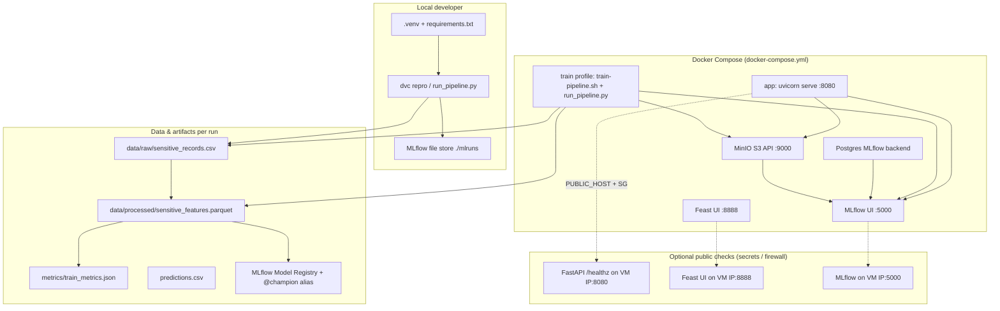
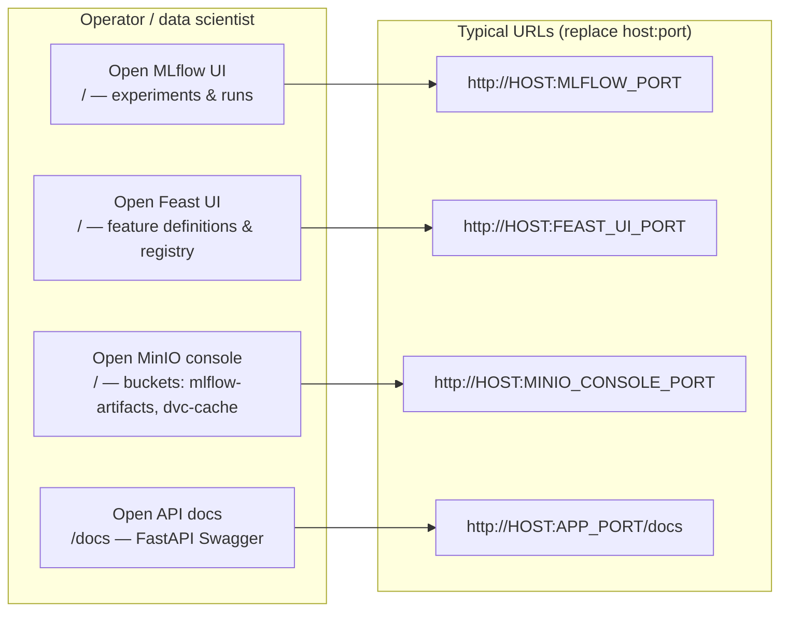
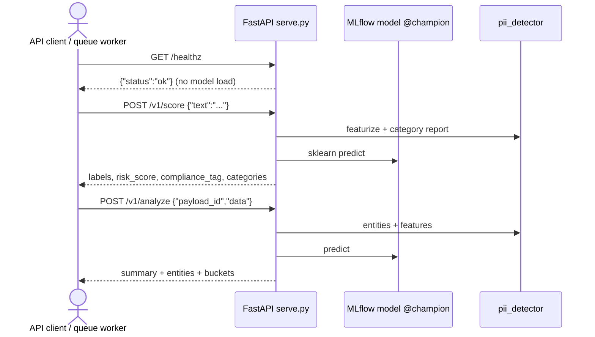
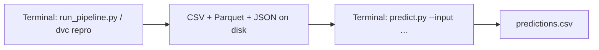
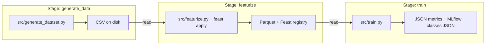
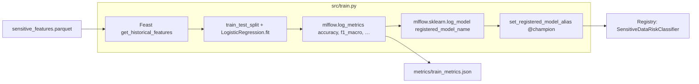
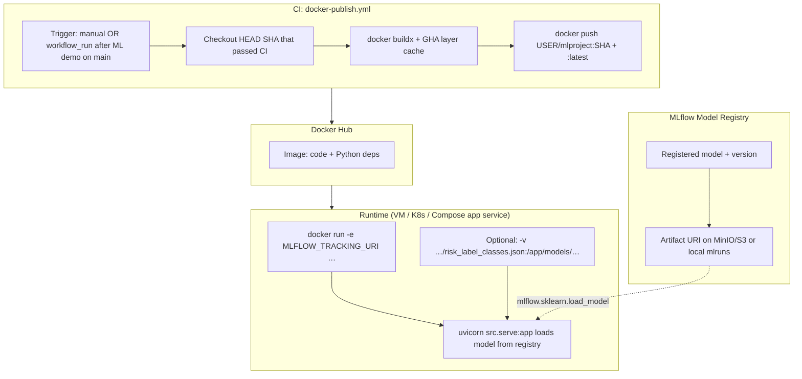
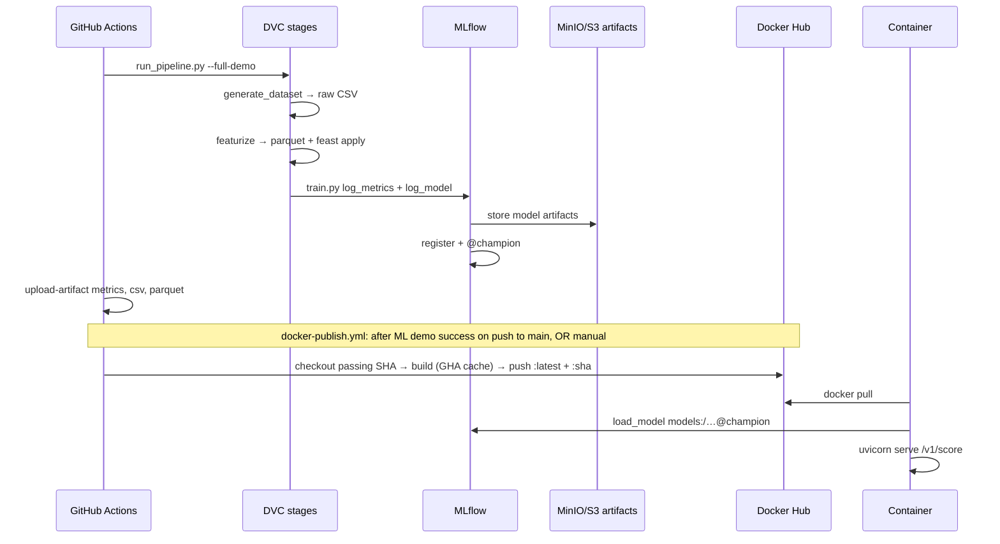

# Architecture, GitHub Actions, and Docker Hub flow

This document matches the code in this repository: **DVC** stages (`dvc.yaml`), **`pipelines/run_pipeline.py`**, **MLflow** registration in **`src/train.py`**, **FastAPI** in **`src/serve.py`**, **`.github/workflows/ml-demo.yml`**, and **`.github/workflows/docker-publish.yml`**. It includes **UI/UX operator and API flows** (§2), **per-stage stored data types** (§3), CI (§4), training/registry (§5–6), and an end-to-end sequence (§7).

---

## 1. System architecture (local, Docker stack, and optional hosted endpoints)

**Public endpoints:** Compose binds services to `0.0.0.0` (see `docker-compose.yml`). Your cloud **firewall / security group** must allow the same TCP ports. CI and `scripts/test_public_endpoints.sh` call those URLs when **`API_HEALTH_URL`**, **`FEAST_UI_URL`**, and MLflow/S3 secrets are set (`docs/GITHUB_SETUP.md`).

Default compose ports (override with **`APP_PORT`**, **`MLFLOW_PORT`**, **`FEAST_UI_PORT`**, **`MINIO_*`** in **`.env`**): API **8080**, MLflow **5000**, Feast UI **8888**, MinIO **9000** / console **9001**.

---

## 2. UI / UX flows (who uses what)

High-level journeys for **operators** (browser / CLI) and **clients** (HTTP). Ports shown are compose defaults; your VM may map different host ports (for example **28181 → 8080**).

### 2.1 Operator surfaces (browser)

| Surface | User goal | Primary UX |
|--------|-----------|------------|
| **MLflow UI** | Compare runs, metrics, registered model **`SensitiveDataRiskClassifier`**, alias **`@champion`** | Tables, run detail, artifact browser, registry tab |
| **Feast UI** | Inspect feature views and entities for **`sensitive_risk_features`** | Registry / feature list (read-heavy) |
| **MinIO console** | Confirm S3 objects for MLflow artifacts and optional DVC remote | Bucket browser, upload/download |
| **FastAPI `/docs`** | Try **`POST /v1/score`**, **`POST /v1/analyze`**, **`GET /v1/categories`** | Swagger form + **Execute** |
| **Prometheus / Grafana** (optional) | Scrape **`GET /metrics`** from the app | Metrics dashboards (see `monitoring/prometheus.yml`) |

### 2.2 API client flow (programmatic)

| Step | Endpoint | User-visible outcome |
|------|----------|----------------------|
| Liveness | **`GET /healthz`** | Load balancer / k8s probe; no scoring |
| Simple score | **`POST /v1/score`** | One text → risk label, heuristic score, PII category rows |
| Queue-style | **`POST /v1/analyze`** | **`payload_id`** + text → entities, **`risk_level`**, category buckets |
| Catalog | **`GET /v1/categories`** | Regex detector keys for UI dropdowns |
| Observability | **`GET /metrics`** | Prometheus text format |

### 2.3 Offline / batch UX (CLI & files)

| Action | Command | UX outcome |
|--------|---------|------------|
| Full train path | **`python pipelines/run_pipeline.py`** or **`dvc repro`** | Progress logs; artifacts under **`data/`**, **`metrics/`**, **`mlruns/`** |
| Batch score | **`python src/predict.py --input … --output …`** | CSV with extra columns appended to input rows |

---

## 3. Pipeline stages: what type of data is stored

DVC stages (**`dvc.yaml`**) chain **generate → featurize → train**. Below: **storage location**, **format**, and **content shape** (synthetic demo data).

### 3.1 Stage map (data in motion)

### 3.2 Per-stage storage (authoritative)

| DVC stage | Script | Primary outputs on disk | Format & schema (conceptual) | Also written / versioned |
|-----------|--------|---------------------------|------------------------------|----------------------------|
| **`generate_data`** | **`src/generate_dataset.py`** | **`data/raw/sensitive_records.csv`** | **CSV** — columns **`record_id`** (int), **`raw_text`** (string), **`risk_score`** (float), **`risk_label`** (LOW/MEDIUM/HIGH), **`compliance_tag`** (string). One row per synthetic “log line”. | DVC tracks file hash in **`dvc.lock`**; optional remote push of cache |
| **`featurize`** | **`src/featurize.py`** | **`data/processed/sensitive_features.parquet`** | **Apache Parquet** — raw columns plus numeric feature columns from **`pii_detector`** (e.g. PAN/AADHAAR/email/phone/account/keyword hit counts, **`text_length`**), **`event_timestamp`** (UTC). | **`feast apply`** updates **`data/feast/`** (registry DB + online store paths per `feature_repo/`; not always in DVC outs) |
| **`train`** | **`src/train.py`** | **`metrics/train_metrics.json`** | **JSON** — **`run_id`**, **`accuracy`**, **`f1_macro`**, **`precision_macro`**, **`recall_macro`** (floats). | DVC **`metrics:`** with **`cache: false`** so it is not double-cached as immutable data |
| **`train`** (continued) | same | **`models/risk_label_classes.json`** | **JSON** — **`{"classes": ["LOW", "MEDIUM", "HIGH"]}`** (order matches sklearn **`LabelEncoder`**). | Gitignored locally; needed beside **`predict.py`** / **`serve.py`** |
| **`train`** (continued) | same | **`mlruns/`** (path from **`MLFLOW_TRACKING_URI`**) | **MLflow file store** or **Postgres + S3** (Docker stack): run metadata, **params/metrics** files, **`artifacts/model/`** (MLmodel, **`model.pkl`**, env YAMLs), registry pointers. | Registered name from **`params.yaml`** (**`SensitiveDataRiskClassifier`**), alias **`@champion`** |
| **After CI / `--full-demo`** | **`src/predict.py`** | **`predictions.csv`** | **CSV** — copies input rows (e.g. **`raw_text`**) + **`predicted_risk_label`**, **`risk_score`**, **`compliance_tag`**. | Not a DVC stage; optional artifact in GitHub Actions |

### 3.3 In-memory vs persistent (train step)

| Data type | Where it lives | Notes |
|-----------|----------------|--------|
| Train/test feature matrices | RAM (`pandas` / `numpy`) | Built from Feast **`get_historical_features`** + labels merge |
| Fitted **`LogisticRegression`** | MLflow artifact **`model.pkl`** | Loaded later via **`models:/…@champion`** |
| Experiment params | MLflow run params | Logged from **`params.yaml`** + trainer hyperparameters |

---

## 4. GitHub Actions — `ml-demo.yml` stage by stage

Each step maps to a **function** in your pipeline (shell or Action).

```mermaid
flowchart TD
  T0([Trigger: push/PR main, workflow_dispatch]) --> S1

  S1["Checkout actions/checkout@v4<br/>Function: clone repo at GITHUB_SHA<br/><i>Job env already set</i>: MLFLOW_TRACKING_URI, AWS_DEFAULT_REGION, MLFLOW_S3_ENDPOINT_URL, AWS keys, API_HEALTH_URL, FEAST_UI_URL — from <b>secrets</b> and <b>vars</b>; default MLflow: workspace/mlruns"]
  S1 --> S3

  S3["setup-python@v5 + pip cache<br/>Function: Python 3.10"]
  S3 --> S4

  S4["pip install -r requirements.txt + requirements-dev.txt<br/>Function: app + pytest"]
  S4 --> S5

  S5["Wire DVC Python path<br/>Function: ln -s runner python → .venv/bin/python"]
  S5 --> S6

  S6["pytest tests/<br/>Function: fail-fast unit/smoke tests"]
  S6 --> S7

  S7["Ensure DVC metadata<br/>Function: test -d .dvc || dvc init --no-scm"]
  S7 --> S8

  S8["Full pipeline + sample predict<br/>Function: python pipelines/run_pipeline.py --full-demo<br/>• dvc repro OR generate → featurize → train<br/>• train: MLflow metrics + register SensitiveDataRiskClassifier @champion<br/>• predict.py → predictions.csv"]
  S8 --> S9

  S9["Validate pipeline outputs (E2E)<br/>Function: python scripts/verify_outputs.py"]
  S9 --> S10

  S10["Optional public checks<br/>Function: curl API /healthz; curl Feast UI<br/>Only if API_HEALTH_URL / FEAST_UI_URL non-empty"]
  S10 --> S11

  S11["E2E summary + upload-artifact demo-outputs<br/>Function: print train_metrics; zip metrics, predictions, raw, parquet, models/risk_label_classes.json"]
```

**Per-build storage** (CI artifact zip): see **§3** for column-level detail. Summary paths:

| Artifact path | Role |
|---------------|------|
| `data/raw/sensitive_records.csv` | Raw synthetic rows (`generate_dataset.py`) |
| `data/processed/sensitive_features.parquet` | Processed features + Feast (`featurize.py`) |
| `metrics/train_metrics.json` | **accuracy**, **f1_macro**, run id (`train.py`) |
| `predictions.csv` | Batch inference on `sample_input.csv` (`predict.py`) |
| `mlruns/` (job workspace) | MLflow runs + model files when tracking URI is local |

Fork PRs do not receive the base repo’s **secrets** or **Actions variables**; those builds use **local `mlruns`** in the runner only.

**`dvc.yaml` and CI:** stages use **`${py}: .venv/bin/python`**. On GitHub Actions, **“Wire DVC Python path”** symlinks the runner’s `python` to **`.venv/bin/python`** (same pattern as **`Dockerfile`**) so **`dvc repro`** succeeds without committing a venv.

---

## 5. Training, metrics, accuracy, and model registry

**Consumers:**

- **`src/predict.py`** — loads `models:/SensitiveDataRiskClassifier@champion` (see `params.yaml`).
- **`src/serve.py`** — same URI via `MLFLOW_MODEL_URI` or `params.yaml`; needs **`models/risk_label_classes.json`** on disk (written by `train.py`).

---

## 6. Model registry → Docker image → Docker Hub → run container

The **Dockerfile** packages **code + dependencies**; it does **not** embed the trained sklearn weights by default (they live in MLflow artifact storage). The **running** container must reach **MLflow** and have **`models/risk_label_classes.json`** (volume from train step, or copy from CI after training).

**GitHub image flow:** **`workflow_dispatch`** runs on demand. **`workflow_run`** runs this workflow after **`ML demo pipeline`** completes **successfully** on a **`push`** to **`main`** (not on every PR), checks out **`head_sha`** from that run so the image matches the tested commit, pushes **`latest`** and **`:<sha>`**, then smoke-tests **`GET /healthz`**. **Forks** skip the job (`fork == false`). Configure **`DOCKERHUB_USERNAME`** and **`DOCKERHUB_TOKEN`**. Build uses **GitHub Actions cache** for Docker layers (`cache-from` / `cache-to` type `gha`).

**Smoke test without scoring:** `GET /healthz` returns `{"status":"ok"}` without loading the model (`serve.py`). **Full inference test** needs MLflow reachable + `risk_label_classes.json` (see `scripts/docker_image_smoke.sh`).

## 7. End-to-end sequence (one diagram)

---

## Related files

| Topic | Path |
|-------|------|
| Local full demo | `scripts/run_full_demo.sh`, `make demo` |
| Same steps as GitHub job (venv bootstrap + full demo) | `scripts/local_test.sh`, `make local-test` |
| Same steps as GitHub job (uses system or `.venv` python) | `scripts/ci_e2e.sh`, `make ci-e2e` |
| Output checks only | `scripts/verify_outputs.py`, `make verify` |
| Docker stack | `docker-compose.yml`, `docs/DOCKER.md` |
| GitHub ML CI | `.github/workflows/ml-demo.yml` |
| Docker Hub push | `.github/workflows/docker-publish.yml` (manual + auto after ML demo on `main`) |
| Public URL smoke | `scripts/test_public_endpoints.sh`, `make public-test` |
