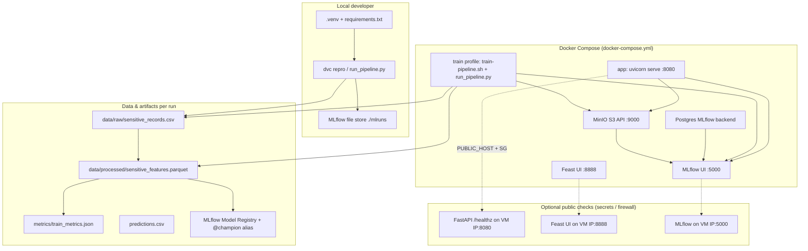
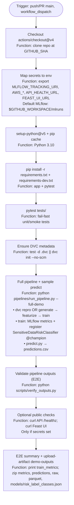
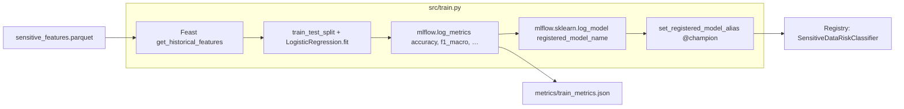
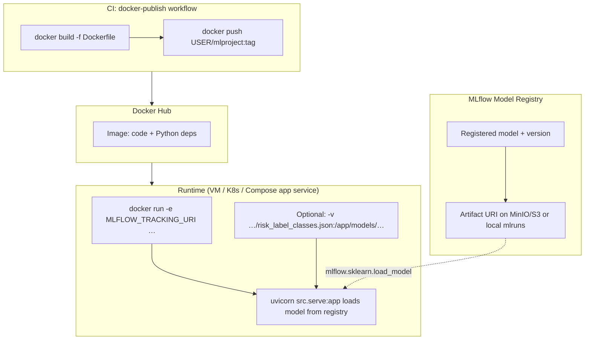
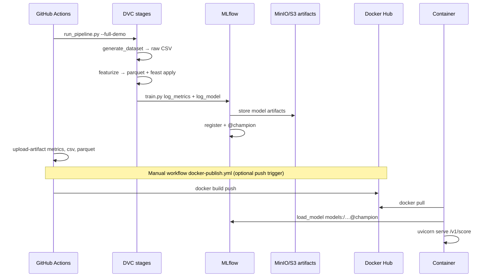

# Architecture, GitHub Actions, and Docker Hub flow

This document matches the code in this repository: **DVC** stages (`dvc.yaml`), **`pipelines/run_pipeline.py`**, **MLflow** registration in **`src/train.py`**, **FastAPI** in **`src/serve.py`**, **`.github/workflows/ml-demo.yml`**, and **`.github/workflows/docker-publish.yml`**.

---

## 1. System architecture (local, Docker stack, and optional hosted endpoints)

**Public endpoints:** Compose binds services to `0.0.0.0` (see `docker-compose.yml`). Your cloud **firewall / security group** must allow the same TCP ports. CI and `scripts/test_public_endpoints.sh` call those URLs when **`API_HEALTH_URL`**, **`FEAST_UI_URL`**, and MLflow/S3 secrets are set (`docs/GITHUB_SETUP.md`).

---

## 2. GitHub Actions — `ml-demo.yml` stage by stage

Each step maps to a **function** in your pipeline (shell or Action).

**Per-build storage:**

| Artifact path | Role |
|---------------|------|
| `data/raw/sensitive_records.csv` | Raw synthetic rows (`generate_dataset.py`) |
| `data/processed/sensitive_features.parquet` | Processed features + Feast (`featurize.py`) |
| `metrics/train_metrics.json` | **accuracy**, **f1_macro**, run id (`train.py`) |
| `predictions.csv` | Batch inference on `sample_input.csv` (`predict.py`) |
| `mlruns/` (job workspace) | MLflow runs + model files when tracking URI is local |

Fork PRs do not receive secrets; those builds use **local `mlruns`** in the runner only.

**`dvc.yaml` and CI:** stages use **`${py}: .venv/bin/python`**. On GitHub Actions, **“Wire DVC Python path”** symlinks the runner’s `python` to **`.venv/bin/python`** (same pattern as **`Dockerfile`**) so **`dvc repro`** succeeds without committing a venv.

---

## 3. Training, metrics, accuracy, and model registry

**Consumers:**

- **`src/predict.py`** — loads `models:/SensitiveDataRiskClassifier@champion` (see `params.yaml`).
- **`src/serve.py`** — same URI via `MLFLOW_MODEL_URI` or `params.yaml`; needs **`models/risk_label_classes.json`** on disk (written by `train.py`).

---

## 4. Model registry → Docker image → Docker Hub → run container

The **Dockerfile** packages **code + dependencies**; it does **not** embed the trained sklearn weights by default (they live in MLflow artifact storage). The **running** container must reach **MLflow** and have **`models/risk_label_classes.json`** (volume from train step, or copy from CI after training).

**Smoke test without scoring:** `GET /healthz` returns `{"status":"ok"}` without loading the model (`serve.py`). **Full inference test** needs MLflow reachable + `risk_label_classes.json` (see `scripts/docker_image_smoke.sh`).

---

## 5. End-to-end sequence (one diagram)

---

## Related files

| Topic | Path |
|-------|------|
| Local full demo | `scripts/run_full_demo.sh`, `make demo` |
| Same steps as GitHub job (venv bootstrap + full demo) | `scripts/local_test.sh`, `make local-test` |
| Same steps as GitHub job (uses system or `.venv` python) | `scripts/ci_e2e.sh`, `make ci-e2e` |
| Output checks only | `scripts/verify_outputs.py`, `make verify` |
| Docker stack | `docker-compose.yml`, `docs/DOCKER.md` |
| GitHub ML CI | `.github/workflows/ml-demo.yml` |
| Docker Hub push | `.github/workflows/docker-publish.yml` |
| Public URL smoke | `scripts/test_public_endpoints.sh`, `make public-test` |
